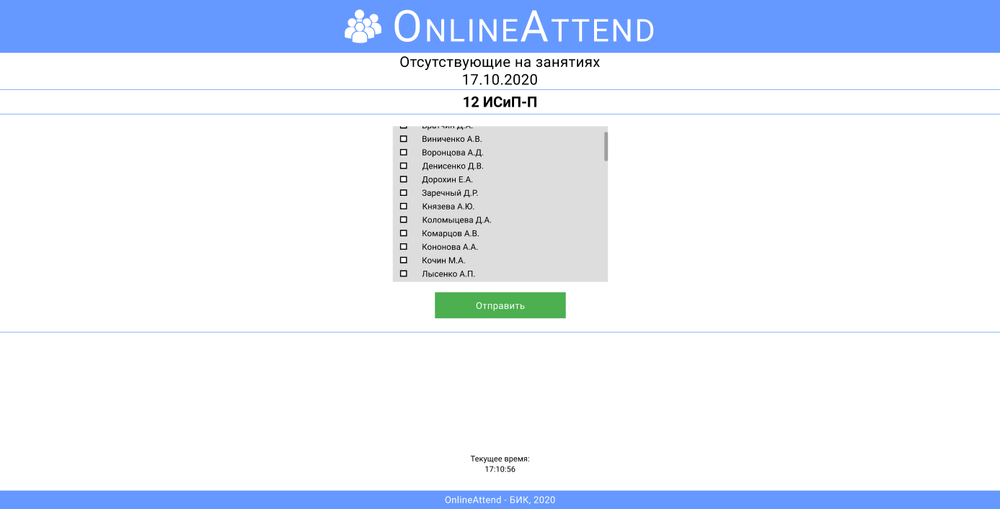

<h1 align="center"><b>Online Attend</b></h1>
<h2><b>Описание</b></h2>

 Отправление и просмотр списка студентов. 

 Во многих образовательных учреждениях старосты ежедневно заполняют бумаги "бегунки" об отсутствующих студентах в группе. 

 Приложение "Online Attend" позволит сократить расходы бумаги и сил.

